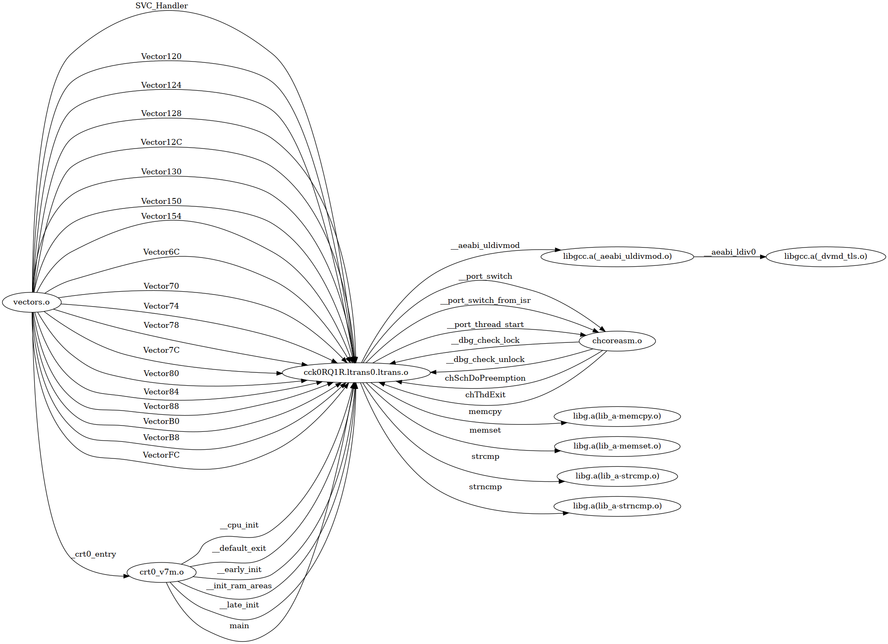

# crt2dot

Visualize GNU LD Cross Reference Table as a digraph using DOT

```
Usage: crt2dot elf-file map-file out-file <types>

Convert GCC LD Cross Reference Table (--cref) to digraph using DOT

<types> is a comma separated list of symbol types to include in
        the graph. If ommited, only FUNC is included

Only functions in the CRT are used for graph generation. It uses
readelf to determine if a symbol in the CRT is a functino or not.
The output is a DOT file, use the dot utility to generate an image.
```

Below are example outputs from building a ChibiOS testhal application with and
without link time optimization (LTO).

```shell
dot -Tpng -Grankdir="LR" -o <filename.png> input.dot
```


Without LTO


With LTO


